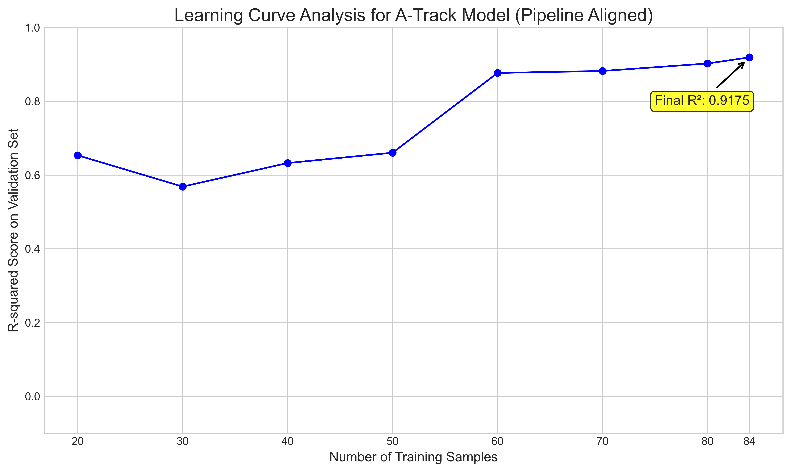

# Personalized Freediving Recovery Analysis & ML Feasibility Study

[](https://www.python.org/downloads/)
[](https://github.com/billy1030714/freediving-recovery-analysis/actions)
[](LICENSE)

## 🎯 Research Objective

This project establishes a **rigorous validation framework** for consumer wearable health monitoring, using freediving recovery as a physiological model. The core contribution is a **dual-track validation methodology** that scientifically delineates the capabilities and limitations of consumer-grade devices in personalized health assessment.

---

## 🔬 Key Innovation: Dual-Track Validation

This project's core innovation is a dual-track methodology to systematically separate algorithm validation from scientific predictability testing.

| Track | Purpose | Features Used | Best R² Score (ERS) | Interpretation |
|-------|---------|---------------|:-------------------:|----------------|
| **A** | **Algorithm Validation** | Pre-dive features + **Recovery-phase data** | **0.9175** | ✅ Effective descriptive tool |
| **B** | **Prediction Boundary** | **Only** Pre-dive features (leak-free) | **-0.1015** | ✅ Confirms prediction limits |

---

## 🚀 Quick Start

### 1. Installation

```bash
# Clone the repository and navigate into it
git clone [https://github.com/billy1030714/freediving-recovery-analysis.git](https://github.com/billy1030714/freediving-recovery-analysis.git)
cd freediving-recovery-analysis

# Install dependencies
pip install -r requirements.txt
```

### 2. Run Local Integration Test (Recommended)

This command runs a fast, automated check of the entire MLOps architecture, verifying that all components work together correctly. It uses a small, sample dataset to ensure speed.

```bash
# Ensure you have the sample export.xml and pre-processed data
# Then, run the master health check script
python scripts/integration_test.py
```

### 3. Run Full Pipeline on Your Data (Optional)

To generate a full report based on your own `export.xml`, run the regression test script without the `--skip-cleaning` flag. **Note:** This will be slow.

```bash
# Place your full export.xml in apple_health_export/
python scripts/regression_test.py
```

---

## 📈 Results Summary

The following results were generated by running the full pipeline on a dataset of 121 measurements (split into training and validation sets).

### Statistical Analysis

The analysis includes comprehensive statistical validation using correlation analysis and p-value testing to ensure the robustness of findings. Key statistical metrics include:

- **Pearson correlation coefficients** with significance testing
- **P-value calculations** for statistical significance validation  
- **Physiological relationship verification** between baseline heart rate and recovery metrics

For detailed statistical analysis of mean RR interval predictions, see `analysis/analyze_mean_rr.py` which provides in-depth correlation analysis and p-value testing.

---

## 🔍 Augmentation Validation (Optional)

We provide a dedicated script to validate the effectiveness of data augmentation on ERS prediction.

To run the validation, execute the following command:

```bash
python scripts/validate_augmentation.py
```

### Track A: Algorithm Validation (`short_term` mode)

This track validates the Early Recovery Score (ERS) as a descriptive tool. The high R² score confirms that the chosen components effectively describe the recovery state.

| Model | R² Score | MAE | RMSE |
|:---|:---:|:---:|:---:|
| **XGBoost (Best)** | **0.9175** | **0.0341** | **0.0472** |
| Random Forest | 0.8204 | 0.0514 | 0.0697 |
| Ridge | 0.7226 | 0.0570 | 0.0867 |

### Track B: Prediction Boundary (`long_term` mode)

This track tests the true predictability of various recovery metrics using only pre-dive features. The results quantitatively define the prediction boundary, showing that while baseline heart rate (`mean_rr_post`) is somewhat predictable, dynamic recovery metrics are not.

| Target Metric | Best Model | Best R² Score |
|:---|:---|:---:|
| **mean_rr_post** | Ridge | **0.3114** |
| pnn50_post | Ridge | 0.0371 |
| hrr60 | Random Forest | -0.0380 |
| sdnn_post | Ridge | -0.0732 |
| ERS | Random Forest | -0.1015 |
| rmssd_post | Ridge | -0.1138 |


### Learning Curve Analysis

Analysis of the Track A model's learning curve provides a key insight: model performance becomes stable and reliable after approximately **60 training samples**, at which point the R² score consistently exceeds 0.88. This suggests a minimum data requirement for achieving personalized, high-fidelity monitoring.



---
## 🏥 Clinical Relevance

1.  **Immediate Applications**
    * Post-exercise recovery assessment
    * Training load optimization
    * Safety monitoring in breath-hold sports

2.  **Future Translation Potential**
    * OSA (Obstructive Sleep Apnea) severity assessment
    * COPD exacerbation prediction
    * Personalized cardiovascular risk stratification
---
## 📁 Project Structure
The project is organized with a clear separation of concerns, facilitating reproducibility and scalability. Folders marked `(gitignored)` are generated locally and not committed to the repository.

```
HRR_project/
├── .github/workflows/      # Automated CI/CD pipelines (GitHub Actions)
├── .gitignore              # Specifies intentionally untracked files
├── README.md               # This file
├── requirements.txt        # Python dependencies
├── setup.py                # Package installation script
├── paths.py                # Centralized path configuration
│
├── analysis/               # Exploratory, one-off analysis scripts
│
├── apple_health_export/    # (gitignored) Raw Apple Health data
│   └── export.xml
│
├── archive/                # Deprecated or old code versions
│
├── assets/                 # Static images and diagrams for documentation
│
├── converted/              # (gitignored) Intermediate data from cleaning
│
├── docs/                   # Sphinx documentation source files
│
├── explainability/         # (gitignored) XAI analysis results (SHAP, LIME)
│
├── features/               # (gitignored) Engineered features for ML
│
├── hrr_analysis/           # Core analysis pipeline modules
│   ├── 01_cleaning.py
│   ├── 02_features.py
│   ├── ... (04_models.py to 08_report.py)
│   └── config.py
│
├── models/                 # (gitignored) Trained models and metadata
│
├── notebooks/              # Jupyter notebooks for exploratory analysis
│
├── predictions/            # (gitignored) Model prediction outputs
│
├── report/                 # (gitignored) Final reports and figures
│
├── scripts/                # MLOps validation and utility scripts
│
├── tests/                  # Unit tests for the project
│   └── data/              # Test data files
│       └── sample_export.xml
│
└── utils/                  # Utility functions (e.g., data_loader)
```
---

## 🔧 Technical Stack

- **ML Framework**: XGBoost, Scikit-learn
- **Explainability**: SHAP, LIME
- **Data Processing**: Pandas, NumPy
- **Statistical Analysis**: SciPy, Pearson correlation, P-value testing
- **CI/CD**: GitHub Actions
- **Validation**: Pytest, Custom MLOps Scripts

---

## 👤 Author

**Yi-Chuan Su (蘇翊銓)**
- 🎓 B.S. Nursing, China Medical University (2024)
- 🏥 Registered Nurse (Taiwan)
- 🏊 AIDA4 & Molchanovs W3 Freediving Instructor Assistant
- 📧 Contact: Via GitHub Issues

## 📄 License

This project is licensed under the MIT License. See the [LICENSE](LICENSE) file for details.

## 🙏 Acknowledgments

- Freediving community - Data collection support
- Open source contributors - Tools and libraries